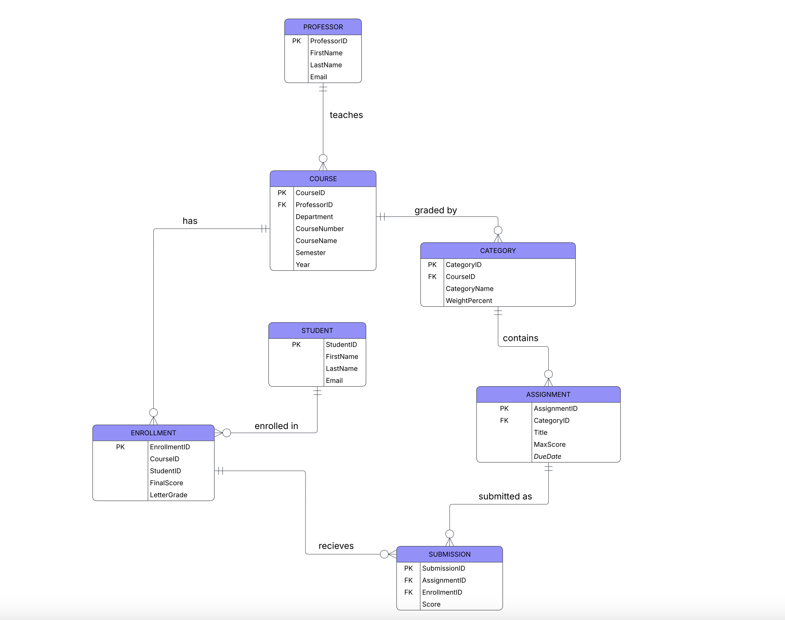

# CSCI 432: Database Systems Project - Gradebook Implementation

## Entity Relationship Diagram (ERD)

## Getting Started
To execute this project, please run the SQL scripts in the following order using a MySQL 8.0 environment (tested on db<>fiddle):
1. `schema.sql` - Sets up the table structures.
2. `data.sql` - Populates the tables with professors, students, and assignment data.
3. `tasks.sql` - Contains the queries for the project requirements.

## Project Test Results
Below are the results generated from the test cases using the `tasks.sql` script.

### 1. Database Initialization (Tasks 2 & 3)
Confirmed table creation and successful data insertion.

### 2. Assignment Analytics & Course Lists (Tasks 4 - 7)
* **Task 4:** Average/Highest/Lowest scores.
* **Task 5 & 6:** Student lists and enrollment verification.
* **Task 7:** Adding a new assignment.

### 3. Updates & Weighted Grade Calculation (Tasks 8 - 11)
* **Task 8:** Category weight updates.
* **Task 10:** Bonus points for students with 'Q' in their name.
* **Task 11:** Final weighted grade calculation.

### 4. Advanced Logic: Dropping Lowest Grade (Task 12)
Calculation of the student's grade after automatically dropping the lowest score in each category.

