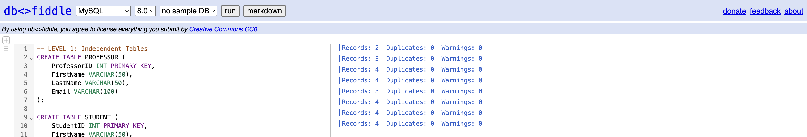
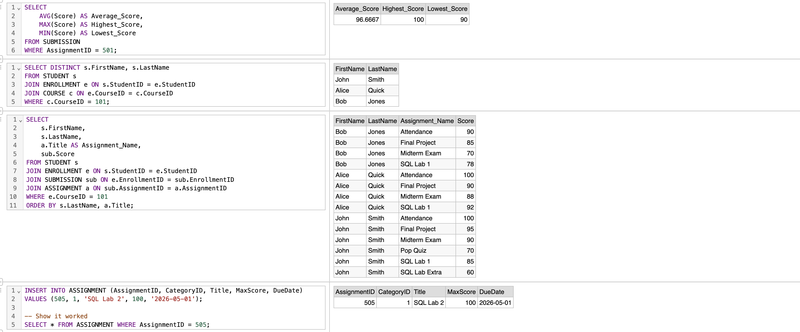
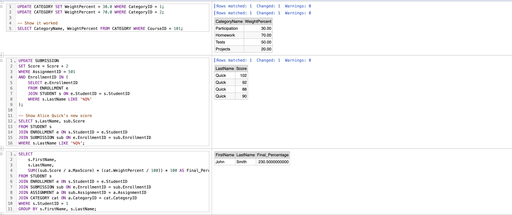
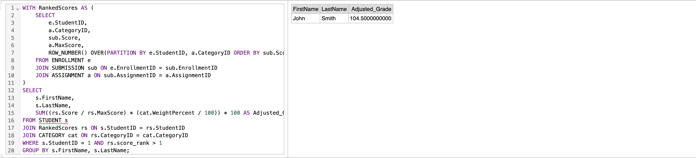

## Project Test Results

Below are the results generated from the test cases using the `tasks.sql` script.

### 1. Database Initialization (Tasks 2 & 3)
Confirmed table creation and successful data insertion.

### 2. Assignment Analytics & Course Lists (Tasks 4 - 7)
* **Task 4:** Average/Highest/Lowest scores.
* **Task 5 & 6:** Student lists and enrollment verification.
* **Task 7:** Adding a new assignment.

### 3. Updates & Weighted Grade Calculation (Tasks 8 - 11)
* **Task 8:** Category weight updates.
* **Task 10:** Bonus points for students with 'Q' in their name.
* **Task 11:** Final weighted grade calculation.

### 4. Advanced Logic: Dropping Lowest Grade (Task 12)
Calculation of the student's grade after automatically dropping the lowest score in each category.

